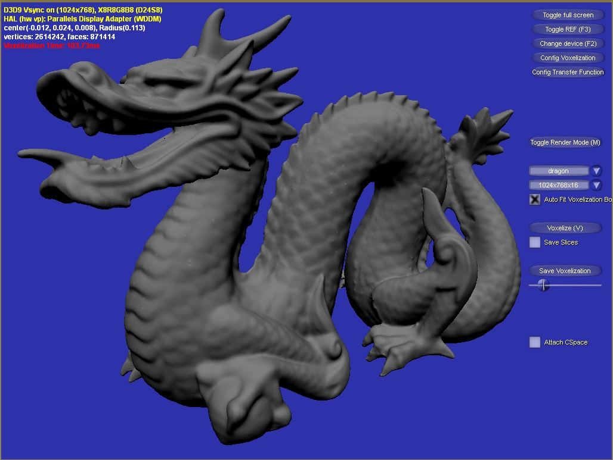
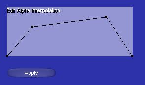

# VolRender

- [Introduction](#introduction)
- [Screenshots](#screenshots)
- [Building the project](#building-the-project)
- [Running the project](#running-the-project)

# Introduction
A demo of performing voxelization on polygonal models then rendering the outcome of the voxelization using volumetric rendering technique implemented using C++, Win32, DirectX9 and HLSL.

# Screenshots
Polygon Rendering						|  Volumetric Rendering
:--------------------------------------:|:--------------------------------------:
			|	
			|	
  |	
			|	

# Building the project
To build this project you need to have [Microsoft DirectX SDK (June 2010)](https://www.microsoft.com/en-us/download/details.aspx?id=6812) installed on your system. The DXSDK_DIR environment variable is typically added by the installer.

# Running the project
Everytime you run the executable, you would need to set the "Transfer Function". You do this by clicking on the "Config Transfer Function" button. Once you do so, the interface will show you a widget that allows you to add,  delete points or move them around. You add new points with a left click, you remove a point with right click. To move a point you hover the cursor over an existing point then press and hold the left mouse button and then move the point. Release the left mouse button when you are done.   
   
To hide the Transfer Function Widget you need to "Config Transfer Function" button again.   
   
After you configure the transfer function, you may click on the "Voxelize" button or press 'V' key to perform the voxelization of the displayed polygon model. The software will perform the voxelization and switch to volumtric rendering mode. To switch back to polygonal rendering mode you need to click the "Toggle Render Mode" or press the 'M' key shortcut.
